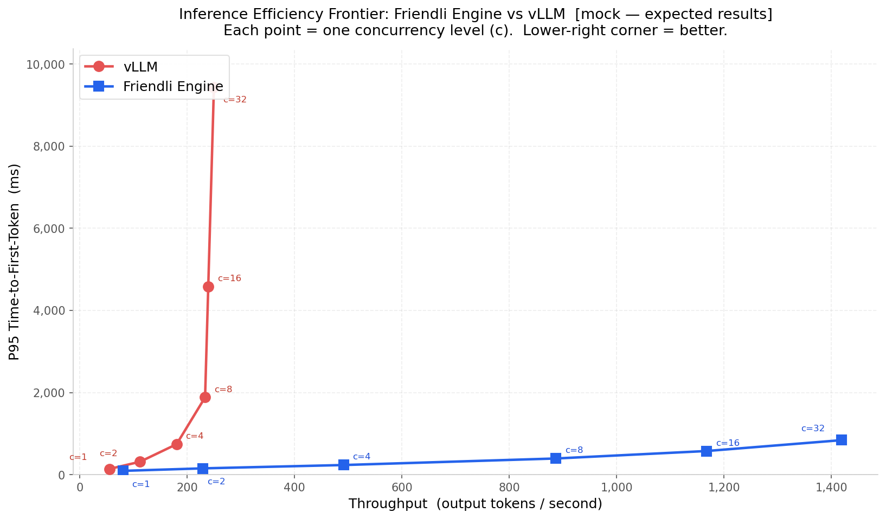

<div align="center">

# Inference Engine Evaluation

**Throughput–Latency efficiency frontier benchmark: Friendli Engine vs vLLM**




*Mock output — data approximated from published FriendliAI benchmarks
([comparing-friendli-engine-vllm](https://friendli.ai/blog/comparing-friendli-engine-vllm),
[quantized-mixtral-single-gpu](https://friendli.ai/blog/quantized-mixtral-single-gpu))*

</div>

---

## Quick Start

```bash
pip install -r requirements.txt
```

```bash
# Preview expected results (no live engines needed)
python benchmark.py --mock

# Real benchmark
python benchmark.py \
  --vllm-url     http://localhost:8000 \
  --friendli-url http://localhost:8001 \
  --model        meta-llama/Llama-3.1-8B-Instruct
```

**Output:** `results/benchmark_result.png` + `results/raw_metrics.json`

---

## Options

| Flag | Default | Description |
|------|---------|-------------|
| `--vllm-url` | `http://localhost:8000` | vLLM server base URL |
| `--friendli-url` | `http://localhost:8001` | Friendli Engine server base URL |
| `--model` | `meta-llama/Llama-3.1-8B-Instruct` | Model name in API requests |
| `--requests-per-level` | `50` | Requests measured at each concurrency level |
| `--output` | `results/benchmark_result.png` | Graph output path |
| `--mock` | off | Generate graph from simulated data |

---

## Requirements

- Both engines must expose an **OpenAI-compatible** `/v1/chat/completions` endpoint
- `stream: true` must be supported — TTFT measurement depends on it
- Same model must be loaded in both engines for a fair comparison

---

## What It Measures

For each concurrency level in `[1, 2, 4, 8, 16, 32]`:

1. Sends 5 warmup requests to eliminate cold-start latency
2. Sends 50 concurrent requests across varied prompts
3. Records **TTFT** per request via streaming SSE
4. Computes **P95 TTFT** and **Throughput** (total output tokens / wall-clock seconds)

---

## Why These Metrics?

### Time-to-First-Token (P95 TTFT)

TTFT is the delay between a user submitting a request and receiving the first token — the latency signal most directly perceived by end users in interactive applications (chat, copilots, search). P95 captures the tail experience that determines whether a product *feels* responsive at scale, not just on average.

TTFT degrades sharply under concurrent load because engines must queue and batch requests. The degree of degradation is the clearest signal of scheduling and batching efficiency — where Friendli Engine's continuous batching and memory management optimizations are most visible.

### Throughput (output tokens / second)

Throughput measures serving capacity: how many tokens all concurrent users receive per second in aggregate. It directly maps to cost efficiency — higher throughput on the same hardware means more users served per dollar.

Measuring throughput alone misses latency; measuring TTFT alone misses capacity. Together they define the efficiency envelope.

---

## Why the Throughput–Latency Frontier?

The efficiency frontier plot (Throughput on X, P95 TTFT on Y, one point per concurrency level) is the industry-standard visualization for comparing inference systems — used in vLLM's own published benchmarks and Anyscale's serving comparisons.

**How to read the graph:**

| | Meaning |
|---|---|
| Each point | One concurrency level `c=N` |
| Moving right | Higher throughput |
| Moving down | Lower latency |
| **Lower-right curve** | **Strictly better** — more throughput *and* lower latency |

The gap between the two curves widens at higher concurrency levels, showing that Friendli Engine's advantage grows under production load — not an idle-state artifact. Both engines look similar at `c=1`, but as concurrency increases vLLM's latency climbs nearly vertically while Friendli maintains a near-linear slope — reaching ~5× higher throughput at a fraction of the latency cost.
